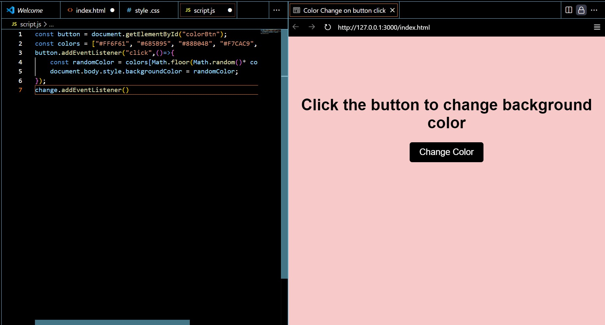

# 🎨 Background Color Changer – Day 7 of 20-Day Frontend Challenge

This is a simple yet fun project where clicking a button changes the background color of the webpage. Built using **HTML**, **CSS**, and **JavaScript**, this project is part of my 20-day frontend development challenge.

## 🚀 Features

- Click a button to randomly change the background color
- Smooth transition effect on color change
- Responsive and clean design

## 🛠️ Technologies Used

- HTML5
- CSS3
- JavaScript (Vanilla)

## 📸 Demo

